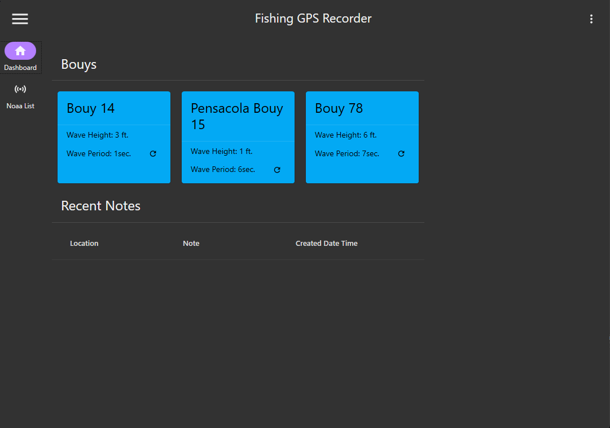
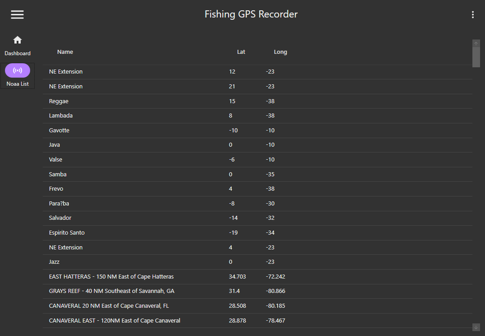

# Fishing GPS Application

## Overview

  
Overview

### Logging
 TODO:// setup logging and add documentation

### Storage
  This project uses ***SQlite*** as a database. The database is created and migrated when the project is started up each time. EntityFramwork is used to manage migrations and database changes

### Project Setup

 

## Pages and Actions

  
Page List

  
  ### Dashboard
  
  The Dasboard page will display the saved bouy locations and will allow a refresh of the data. The Dashboard will also display the 5 most recent notes created.
  
  ### Noaa Bouy List
  
  The Noaa Bouy List page pulls bouy locations from the Noaa Active Stations xml webpage. The list is filtered for bouys that have names.

  TODO://  Add Search functionality to Grid Veiw and documentation 

  Revelant Links:
   - [Noaa XML List](http://www.ndbc.noaa.gov/activestations.xml)

  ### Manage Locations
  TODO:// create mock-ups and descriptions
 

